# Garden Nerd : Flower Recognition Data Science Competition
For several years, flower recognition in the wildlife has been an area of great interest among biologists. Recognition of flowers in environments such as forests and mountains is necessary to know whether they are extinct or not. While search engines assist in searching for a flower, they  lack the robustness because of the intra-class variation among millions of flower species.

The application of Deep Learning is rapidly growing in the field of computer vision and is helping in building powerful classification and identification models. We can leverage this power to build models that can classify and differentiate between different species of flower. 

In this dataset, I have 18,540  images of 102 different species of flowers. I've build a model such that given an image, the model is able to predict the probability of every flower class.

# Dataset
[The dataset can be downloaded from here](https://he-public-data.s3-ap-southeast-1.amazonaws.com/HE_Challenge_data.zip)

# Approach Presentation
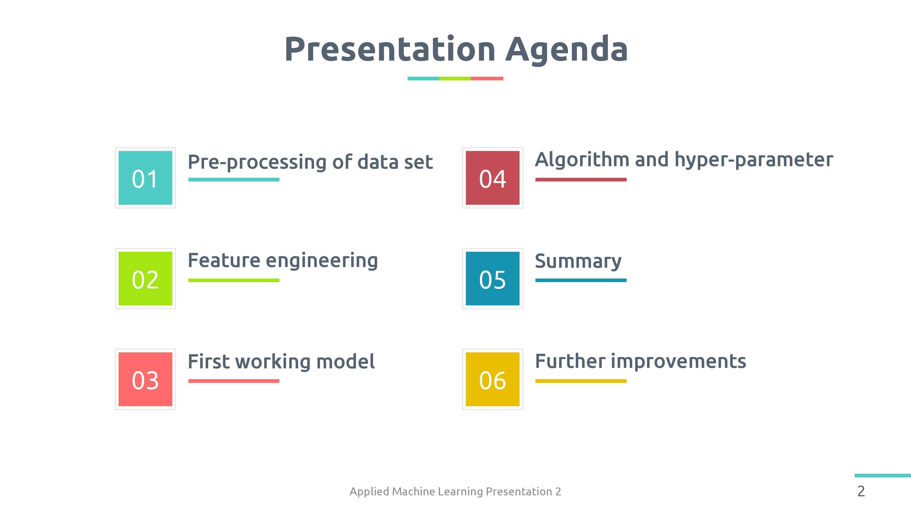

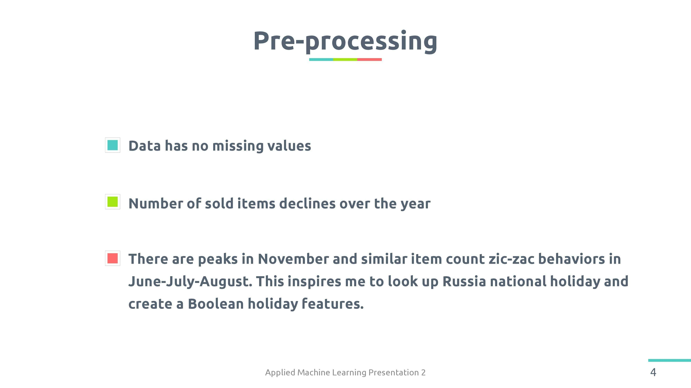

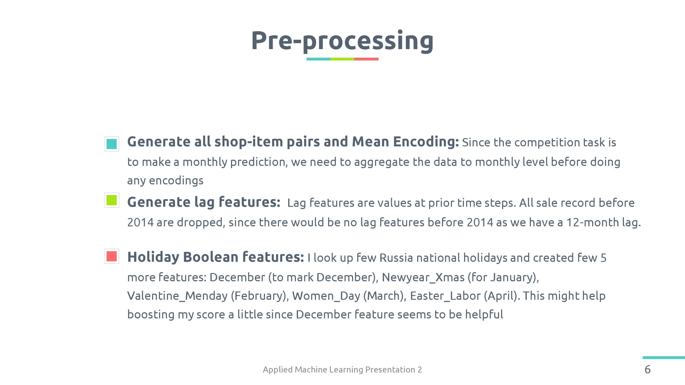

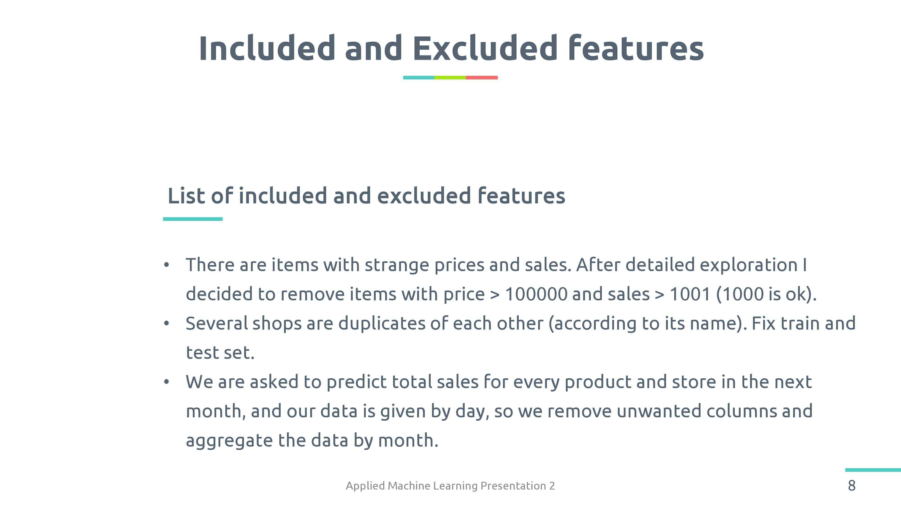

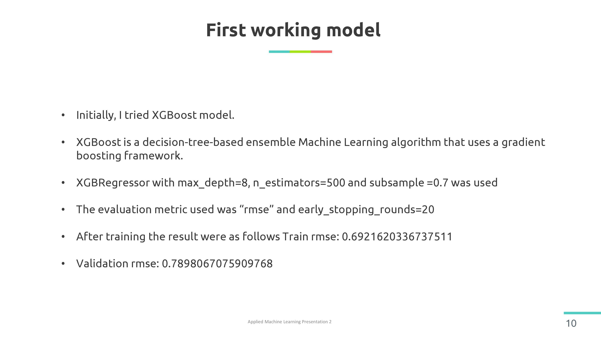

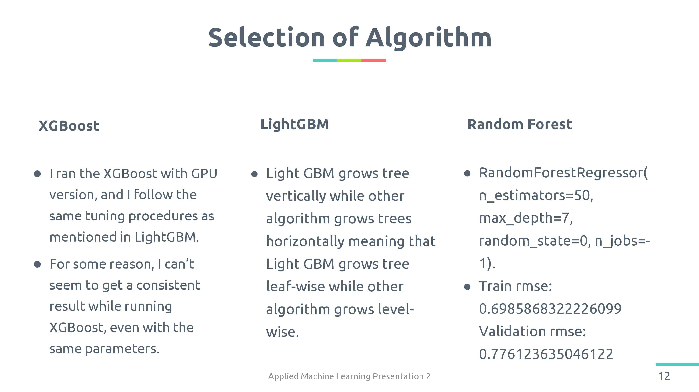

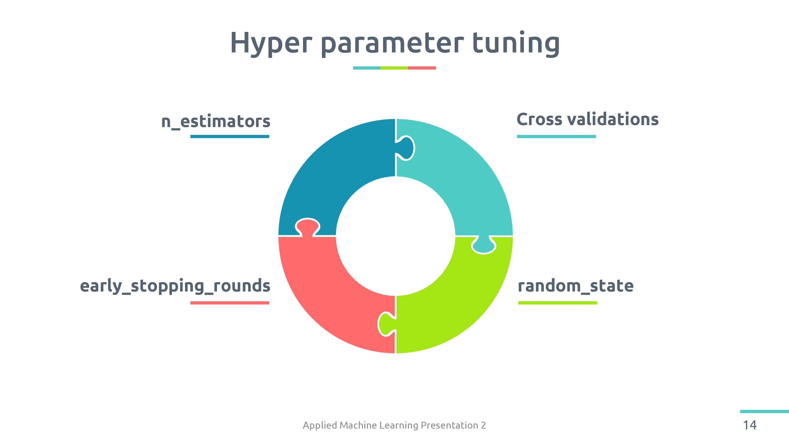

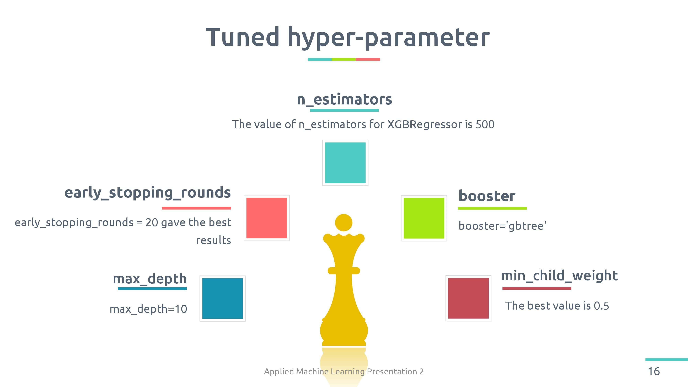

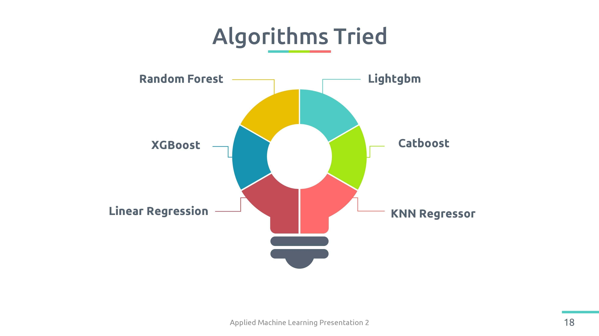
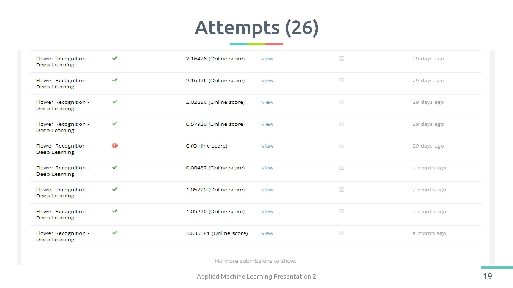

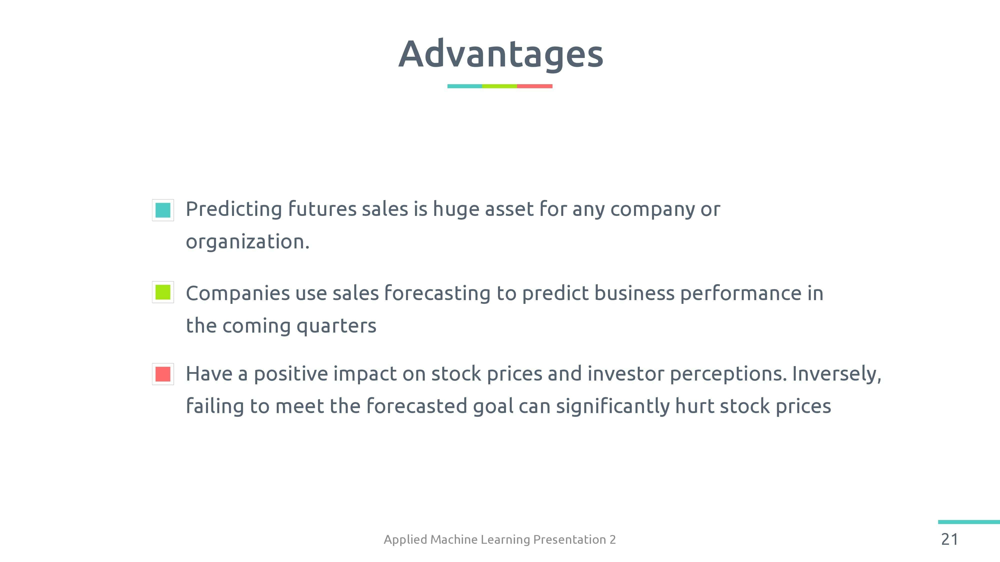
